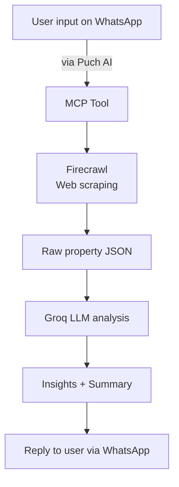

# 🏠 Smart Property Finder

Smart Property Finder is a **Model Context Protocol (MCP)** tool built for the **Puch AI WhatsApp bot**. It helps users discover real-estate listings and get intelligent property insights directly in chat.

Using **[Firecrawl](https://firecrawl.dev)** for web scraping and **Groq LLM** for deep contextual analysis, this project allows users to retrieve personalized property recommendations from platforms like **99acres** and **SquareYards**.

---

## ✨ Features
- 🔍 **Scrape property listings** using Firecrawl based on user queries.  
- 🧠 **LLM-powered analysis** of property data and location context via Groq API.  
- 💬 **Delivered on WhatsApp** using Puch AI’s conversational interface.  

---

## 🛠️ How It Works


---
## 🚀 Installation & Setup

### Prerequisites
- Python 3.8 or higher
- pip (Python package manager)
- Git

### Step 1: Clone the Repository
```bash
git clone https://github.com/21lakshh/Smart-Property-Finder 
cd Smart Property Finder
```

### Step 2: Environment Configuration
Create a `.env` file in the root directory:
```bash
FIRECRAWL_API_KEY=""
GROQ_API_KEY=""
MY_NUMBER=""
TOKEN=""
```

### Step 3: Run the Application
```bash
python main.py
```

The application will be available at `http://0.0.0.0:8085`

### Step 4:Use this command to connect Puch with your mcp server
```bash
/mcp connect <SERVER URL (should be publicly accesible)>/mcp <AUTH TOKEN>
```

